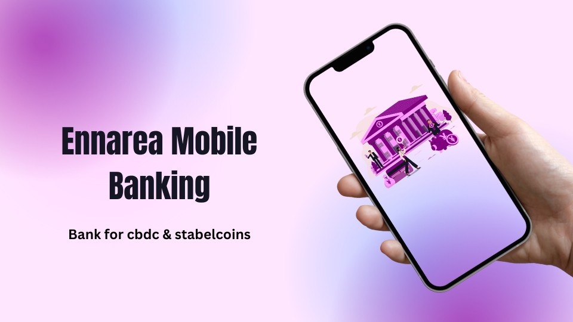

# Ennarea Mobile Banking

## Introduction:

Ennarea Mobile Banking is a new startup that has entered the financial market with a focus on serving the growing demand for central bank digital currencies (CBDCs) and stablecoins. The company has recognized the trend of digitalization and the increasing popularity of cryptocurrencies and is looking to offer an innovative and convenient solution for managing these assets.

The world is rapidly moving towards a cashless society, and digital currencies have become a popular alternative to traditional fiat currencies. CBDCs, in particular, are gaining widespread attention due to their ability to offer the same level of security and reliability as traditional currencies, while also providing the benefits of digitalization. Stablecoins, on the other hand, are gaining popularity due to their stability and ability to preserve the value of the underlying assets, such as the US dollar or gold.

Ennarea Mobile Banking aims to provide a simple and user-friendly platform for people to manage their digital assets. With its focus on security and ease of use, the company is poised to be a key player in the market for digital currencies. The platform is designed to be intuitive, making it easy for users to store, transfer, and exchange their digital assets. Additionally, the company is working on implementing the latest security measures to ensure the safety of its customers' assets.

## Features:

1. Multi-Currency Support: Ennarea Mobile Banking will support multiple digital currencies, including central bank digital currencies (CBDCs) and stablecoins, allowing customers to easily manage their digital assets.

2. Real-Time Transactions: The platform will allow customers to make real-time transactions, allowing for quick and easy transfers of digital assets.

3. Customizable Dashboard: Customers will have the ability to customize their dashboard, making it easy for them to view and manage their digital assets in a way that is most convenient for them.

4. Integration with Other Wallets: Ennarea Mobile Banking will integrate with other digital wallets, allowing customers to transfer digital assets from one platform to another.

5. Biometric Authentication: The app will support biometric authentication, such as facial recognition or fingerprint scanning, to enhance security and make it easier for customers to access their accounts.

6. Intuitive User Interface: The platform will have a simple and user-friendly interface, making it easy for users to navigate and manage their digital assets.
7. Mobile compatibility: Compatibility with both iOS and Android mobile devices.

## Functionalities:

1. Account management: This includes the ability for users to create and manage their mobile banking account, view account balances, transaction history, and personal information.

2. Bill payments: This allows users to pay their bills such as utility bills, mobile phone bills, and others directly from their mobile banking account.

3. Money transfers: This enables users to send and receive money instantly to other users within the same platform or to other bank accounts.

4. Currency conversion: This allows users to convert their money from one currency to another, including digital currencies.

5. QR code payments: This allows businesses to accept payments using QR codes, making it easier for them to process payments and manage their finances.

6. Online checkout button: This feature allows businesses to add an online checkout button to their website, making it easy for customers to make payments.

7. Affiliate program: This program enables small businesses to earn extra income by converting paper money to digital money and earning a percentage of the transaction.

8. SMS banking: This allows users to access banking services via text messages even in areas with low internet penetration.

9. Mobile wallet: This feature allows users to store their digital currency and use it to make payments, send and receive money, and manage their finances.

10. Notifications and Alerts: The app will provide real-time notifications and alerts, keeping customers informed of any changes to their digital asset portfolio and allowing them to take action if needed.

## Services:

1. Payment processing and transaction services for businesses

2. Instant money transfer services for individuals and businesses

3. Bill payment and utility payment services

4. Financial management and budgeting tools for individuals

5. SMS banking services for low-internet areas

6. Affiliate program for small businesses to earn extra income

## Microservice architecture:

1. User Management Microservice: This microservice is responsible for managing user accounts, authentication, and authorization. It includes features such as registration, login, password reset, and profile management.

2. Transaction Management Microservice: This microservice is responsible for handling all transactions, including deposits, withdrawals, money transfers, and bill payments. It includes features such as transaction history, balance inquiry, and transfer/payment confirmations.

3. Conversion Microservice: This microservice is responsible for converting physical money to digital currency and vice versa. It includes features such as exchange rate calculation, transaction processing, and fee management.

4. Payment Processing Microservice: This microservice is responsible for processing payments made through the Ennarea platform. It includes features such as payment gateway integration, transaction processing, and fee management.

5. Affiliate Management Microservice: This microservice is responsible for managing the Ennarea affiliate program. It includes features such as affiliate registration, commission calculation, and payout management.

6. SMS Banking Microservice: This microservice is responsible for providing SMS banking services to users without access to smartphones or the internet. It includes features such as balance inquiry, money transfer, bill payment, and transaction confirmation through text messages.

Each of these microservices communicates with one another through APIs, allowing them to work together to provide a comprehensive mobile banking solution. This architecture allows for greater flexibility, scalability, and reliability, as each microservice can be developed, deployed, and maintained independently.

## high-level design of a cloud infrastructure using Amazon Web Services (AWS):
1. AWS VPC: Ennarea Mobile Banking would be deployed in a Virtual Private Cloud (VPC) in AWS to ensure secure and isolated network environment.

2. AWS EC2: Ennarea would use Amazon Elastic Compute Cloud (EC2) to host the application servers and web servers. EC2 instances would be configured with necessary software, libraries, and tools required to run the application.

3. AWS RDS: To store the transactional and non-transactional data, Ennarea would use Amazon Relational Database Service (RDS) that provides managed relational database services. This would help to offload the database administration tasks and ensure high availability and reliability of the database.

4. AWS S3: To store large amounts of data, Ennarea would use Amazon Simple Storage Service (S3) for file storage. This would help to store user data, backups, and any other data that needs to be stored for a long time.

5. AWS CloudFront: To provide a faster and secure delivery of the application's web pages, Ennarea would use Amazon CloudFront. CloudFront would distribute the content from EC2 and S3 to the end-users, improving the performance and reducing the load on the servers.

6. AWS Lambda: To run the background processes and perform other tasks, Ennarea would use AWS Lambda. Lambda would help to run the processes without having to provision and manage servers.

7. AWS SNS: To send notifications and alerts to users, Ennarea would use Amazon Simple Notification Service (SNS). SNS would help to ensure the delivery of notifications and alerts to users, and also manage the delivery of SMS notifications through SMS banking.

8. AWS CloudWatch: To monitor the performance and health of the application and the underlying infrastructure, Ennarea would use Amazon CloudWatch. CloudWatch would provide performance metrics, logging, and alarms to help identify and resolve any issues with the application and infrastructure.

This cloud infrastructure design would provide a scalable, secure, and highly available platform for Ennarea Mobile Banking. By leveraging the AWS services, Ennarea would be able to focus on delivering a high-quality user experience, without having to worry about managing the underlying infrastructure.

## Conclusion:

Ennarea Mobile Banking is poised to become a key player in the market for digital currencies, with its focus on providing a secure and user-friendly platform for managing CBDCs and stablecoins. The company's combination of innovative app features and functionalities, combined with a comprehensive marketing strategy, will likely make it a popular choice for those looking to manage their digital assets. As the world continues to move towards digitalization, Ennarea is well positioned to meet the growing demand for solutions in this space.

